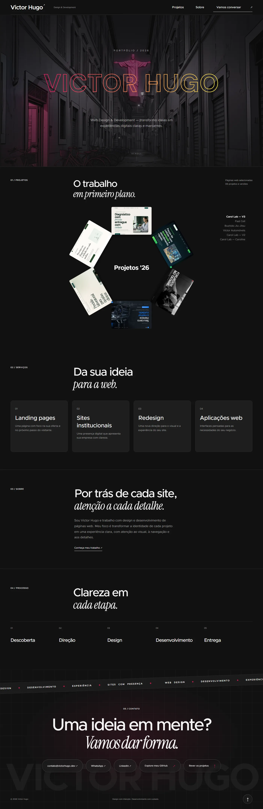
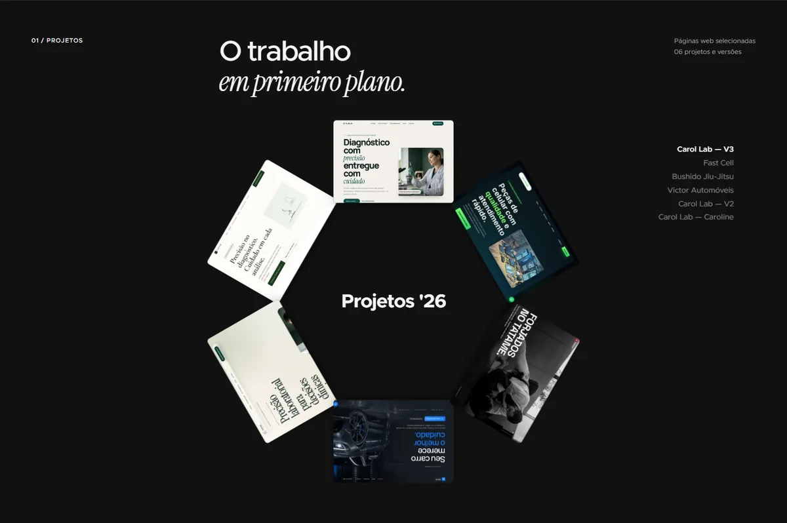
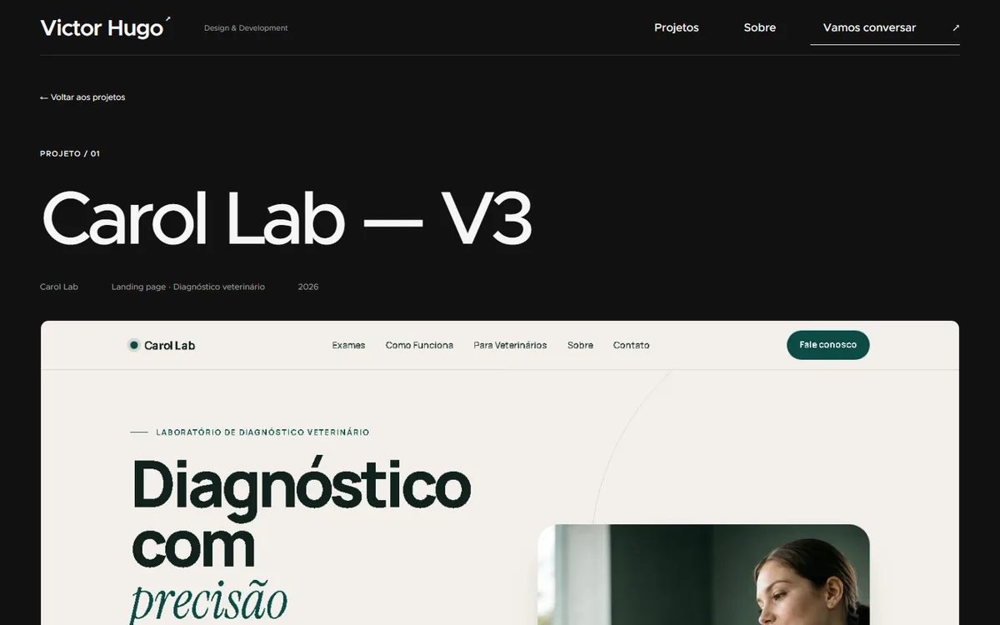
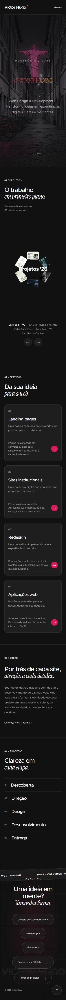

# Victor Hugo — Portfólio

Portfólio pessoal de **web design e desenvolvimento**. Site de apresentação com hero animado, roda 3D de projetos e transições cinematográficas entre páginas.

**🌐 Online:** https://victor-hugo-portfolio-mocha.vercel.app

---

## Capturas

### Home


### Projetos (Works Wheel)


### Case do projeto


### Mobile


---

## Destaques

- **Hero com path drawing** — o nome é desenhado traço a traço em SVG (loop de 2s, para no nome completo)
- **Works Wheel** — carrossel 3D único: os projetos começam em anel ao redor do título e abrem em tambor vertical no scroll/drag
- **View Transitions** — a imagem do projeto conecta a imagem do case ao navegar
- **Seção de serviços** — cards que expandem explicação no hover
- **Random letter swap** — efeito de letras embaralhando na navegação
- **Contato cinematográfico** — marquee, glow magnético e pills de contato
- **Acessibilidade** — `prefers-reduced-motion`, navegação por teclado, skip link, foco visível

## Stack

| Camada | Tecnologia |
|--------|-----------|
| Framework | React 19 + TypeScript |
| Build | Vite |
| Roteamento | React Router 7 |
| Animação | GSAP (scroll), rAF puro (wheel), View Transitions API |
| Estilo | CSS puro com design tokens (variáveis CSS) |
| Hospedagem | Vercel (deploy automático a cada `git push`) |

## Rodando localmente

```bash
npm install
npm run dev        # http://localhost:5173
```

Outros comandos:

```bash
npm run build      # TypeScript + build de produção
npm run lint       # ESLint
```

## Estrutura

```
src/
├── components/
│   ├── hero/          # Hero com path drawing animado
│   ├── layout/        # Header, footer, contato cinematográfico
│   ├── projects/      # Works Wheel (roda 3D) e visuais de projeto
│   ├── services/      # Cards de serviços com expand no hover
│   └── ui/            # RandomLetterSwap (efeito nas nav links)
├── content/
│   ├── projects.ts    # ← lista de projetos (adicionar/remover)
│   └── site.ts        # ← contatos, serviços, textos
├── pages/             # Home, ProjectCase, NotFound
├── motion/            # Hooks GSAP, view transitions, reduced motion
└── styles/global.css  # Design tokens e estilos globais
public/images/projects/  # Screenshots dos projetos (webp)
```

## Editar o site

Guia completo em **[COMO_EDITAR.md](COMO_EDITAR.md)** — contatos, novos projetos, textos e como publicar.

Resumo:

1. Edite `src/content/site.ts` (contatos) ou `src/content/projects.ts` (projetos)
2. Teste: `npm run dev`
3. Publique:

```bash
git add .
git commit -m "descreva a mudança"
git push    # deploy automático na Vercel
```

## Licença

Projeto pessoal. Todos os projetos exibidos são de autoria própria ou de clientes, com imagens locais.
